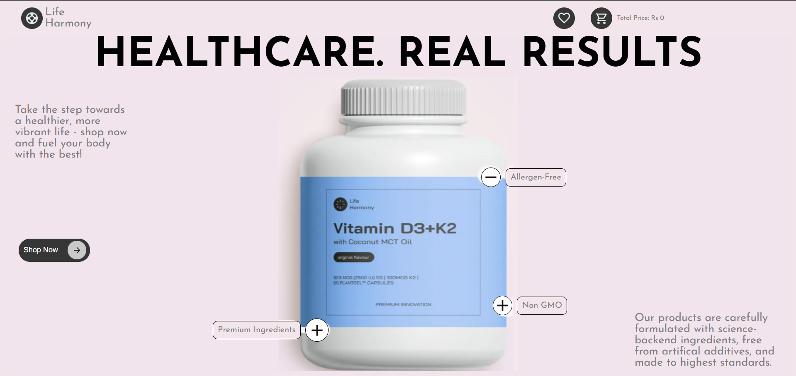
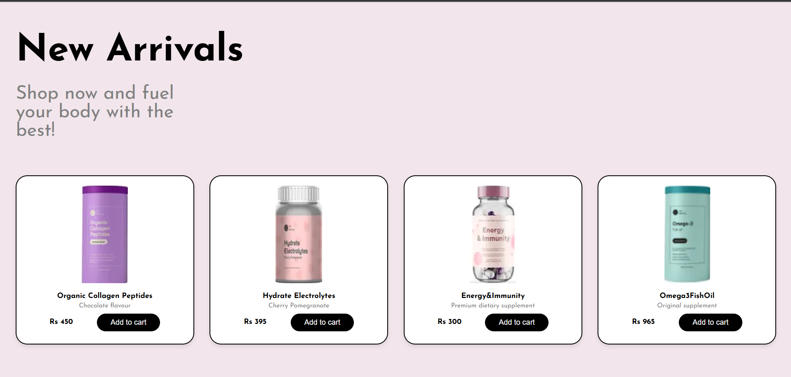

# 🛒 Life Harmony

Welcome to the **E-Commerce Platform for New Medicines** – a responsive and user-friendly web application developed using **HTML, CSS, JavaScript, and PHP**. This platform is designed to provide customers with a seamless experience to browse and purchase newly launched or rare medicines.

## 👩‍💻 Developed By

**Ashi Sinha**  
\_Faculty Guide: Dr Ramesh C

---

## 🌟 Features

- 🔐 **User Authentication** (Login/Signup)
- 🧾 **Browse New Medicines**
- 🛍️ **Add to Cart** Functionality
- 💅 **Aesthetic UI/UX** with responsive design
- 💾 **PHP & MySQL backend** to store user and cart data

---

## 💻 Tech Stack

- **Frontend:** HTML, CSS, JavaScript
- **Backend:** PHP
- **Database:** MySQL

---

## 📸 Screenshots

## 
